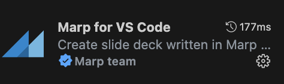
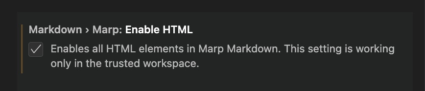

<!-- slide 1-->
<style scoped>
    .title {
        top: 33%;
    }
</style>

<p class="title">Découverte de Marp</p>
<footer>par Vincent Rojo</footer>


---
<!-- slide 2 -->

<h3 class="summary"> I. Installation et paramétrage rapide</h3>
<h3 class="summary"> II. Fonctionnement</h3>
<h3 class="summary"> III. Création d'un thème</h3>
<h3 class="summary"> IV. Partage/Conversion</h3>


---
<!-- slide 3 -->

<p class="title">Installation</p>
<div class="flex">
<div class="mr">
<p>Tout simplement ajouter l'extension "Marp for VS Code"</p>
</div>


</div>
<br>
<i class="small">Marp peut aussi être installé avec un package manager</i>


---
<!-- slide 4 -->

<span>Autoriser l'utilisation de balises HTML depuis les paramètres de l'extension</span>
<div class="mauto">


</div>


---
<!-- slide 5 -->

<p class="title">Customisation rapide</p>
<p>3 thèmes disponibles par défaut :  <span class="blue">default</span> / uncover / <span class="warning">gaia</span></p>

```
theme: uncover
```

<p>L'ajout de l'attribut class (optionnel)</p>

```cs
class: invert
```


---
<!-- slide 6 -->

<p class="title">Fonctionnement</p>

<span class="flex">Créer un fichier
    <i class="orange mr">"slides.md"</i>
    <i class="small">(le nom n'a pas d'importance)</i>
</span>

<span>Ajouter le texte suivant au début du fichier pour que l'IDE comprenne qu'il s'agit d'un fichier Marp :</span>


```cs
---
marp: true
theme: uncover
class: invert
---
```

---
<!-- slide 7 -->

<style scoped>
    div {
        position: absolute;
        top: 25%;
    }
    span {
        text-align: left;
        margin-top: 0;
        align-items: center;
        justify-content: flex-start;
    }
    p {
        flex: 1;
    }
    pre {
        min-width: 700px;
        right: 30px;
        margin-left: auto;
        margin-right: 0px;
    }
</style>
<div class="flex-col mt">
<span class="flex">
<p>Créer une slide :</p>

```
---
```
</span>

<span class="flex">
<p>Insérer une image :</p>

```

```
</span>

```


```


---
<!-- slide 9-->
<style>
    pre {
        min-width: 45%;
        right: 30px;
        margin-right: auto;
    }
</style>
<span>Possibilité de structurer les slides grâce aux balises HTML</span>
<br>

<div class="flex">
<div>Créer des zones de texte pour organiser les slides</div>
<div class="line"></div>

```html
<div class="flex-col">
    <span>colonne 1</span>
    <div class="line"></div>
    <span>colonne 2</span>
<div>
```
</div>


---
<!-- slide 8 -->

<span>Utiliser le HTML et le CSS pour gérer le positionnement et l'affichage des éléments.</span>
<p class="mt">Gestion du CSS classique entre les balises :</p>

```html
<style></style>
```
<br><span>Ajouter "scoped" pour limiter le CSS à la slide :</span>

```html
<style scoped></style>
```


---
<!-- slide 10 -->
<style scoped>
    i {
        display: flex;
        text-align: left;
    }
</style>

<!--_backgroundColor: #272727-->
<!--_color: yellow-->

<i>Fonctionnement similaire pour les directives qu'on peut appliquer à une seule slide.</i>

```
<!--_backgroundColor: #272727-->

<!--_color: yellow-->
```


---
<!-- slide 11 -->

<p class="title">Création d'un thème</p>
<p>Créer un fichier CSS (<i>ex:</i> <i class="orange">"styles.css"</i>) au même endroit que <i class="orange">"slides.md"</i> avec les lignes suivantes :</p>

```html
/*
@theme monTheme
*/

@import 'uncover';
```

<div class="com1">Nom donné au thème →</div>
<div class="com2">
    ← Le thème qu'on veut override<br>
    pour en conserver une partie<br>des paramètres CSS
</div>


---
<!-- slide 12 -->


Remplacer le nom du thème dans le fichier <i class="orange">"slides.md"</i>
```
theme: monTheme
```
Créer un dossier ".vscode" à la racine du projet qui va contenir le fichier settings.json avec le code suivant :

```json
{
    "markdown.marp.themes": [
      "./src/styles.css"
    ]
}
```


---
<!-- slide 13 -->
<style>
    pre {
        margin-left: unset;
        margin-right:unset;
    }
</style>

<p class="title">Partage/Conversion</p>
<p>Commandes pour convertir la présentation (html, pptx, pdf)</p>

```
npx @marp-team/marp-cli@latest slide-deck.md
npx @marp-team/marp-cli@latest slide-deck.md -o output.html

npx @marp-team/marp-cli@latest slide-deck.md --pptx
npx @marp-team/marp-cli@latest slide-deck.md -o output.pptx

npx marp --html --output=dist --input-dir=src
```


---
<!-- slide 14 -->

<div class="flex">
    <div class="flex-col">
        <span class="pros-and-cons">Avantages</span>
        <div class="flex pros">
            <h3 class="mr">⊕</h3>
            <span>Prise en main simple</span>
        </div>
        <div class="flex pros">
            <h3 class="mr">⊕</h3>
            <span>Customisation sauvegardable</span>
        </div>
        <div class="flex pros">
            <h3 class="mr">⊕</h3>
            <span>Possibilité de convertir le fichier</span>
        </div>
    </div>
    <div class="line"></div>
    <div class="flex-col">
        <span class="pros-and-cons">Désavantages</span>
        <div class="flex cons">
            <h3 class="mr">⊖</h3>
            <span>Connaissances en HTML/CSS nécessaires</span>
        </div>
        <div class="flex cons">
            <h3 class="mr">⊖</h3>
            <span>Très couplé à VS Code</span>
        </div>
        <div class="flex cons">
            <h3 class="mr cons">⊖</h3>
            <span>Pas de modification sur un fichier converti</span>
        </div>
    </div>
</div>


---
<!-- slide 15 -->

# Merci pour votre attention 🙂
